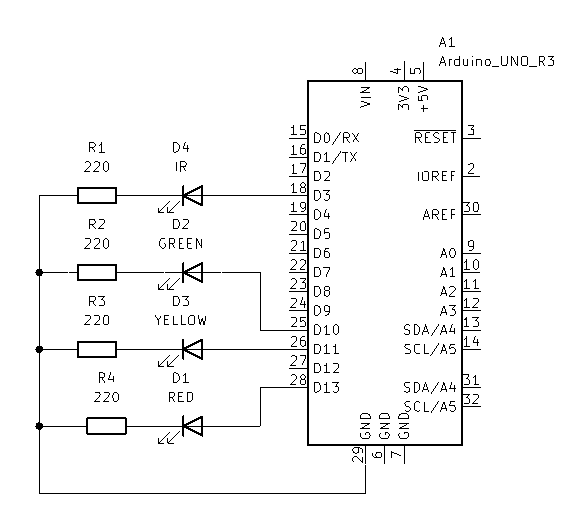
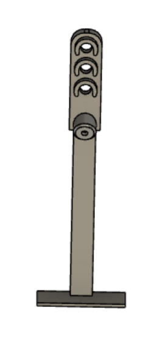

# Zumo IR lyskryss
- [Zumo IR lyskryss](#zumo-ir-lyskryss)
  - [Arduino Uno](#arduino-uno)
    - [Krets skjematikk](#krets-skjematikk)
    - [3D modell](#3d-modell)
    - [Kode eksempel](#kode-eksempel)
  - [Zumo](#zumo)
    - [Kode eksempel](#kode-eksempel-1)

Eksempel på lyskryss for zumo bilen som benytter IR lys og NEC protokollen for og sende informasjon om lyskryssets tilstand.

Koden benytter seg av `IRemote` biblioteket for sending og mottak av NEC data.

Eksempelkoden har deffinert noen ID-er og kommandoer for NEC komunikkasjonen.
|Enhet| ID|
|-----|---|
|Lyskryss| 0x01|

|Kommando | Kode |
|----|---|
|Rødt lys | 0x34 |
|Gult lys | 0x35 |
|Grønnt lys | 0x36 |


## Arduino Uno

Arduino-en brukes til og styre lyskryset og sende informasjon til zumo bilen. Kretsen til dette programmet består av tre vanlige lysdioder (Rød, gul og grønn) og en IR lysdiode.
De fargede lysdioden kan styres av alle digitalportene, men er i eksempelkoden satt til port 10-12. IR lysdioden kan styres av alle digitalporter med PWM utgang, og er her satt til port 3. 

### Krets skjematikk

### 3D modell
[.STL fil](Lyskryss.stl)



### Kode eksempel

[Lyskryss.ino](Lyskryss.ino)

```cpp
/*
* code for traffic light with IR communication to the zumo robot
* run on an arduino. The code sends IR signals containing device address and code
* for the traffic light state every SEND_INTERVALE and changes state every LIGHT_CHANGE_INTERVAL
*/

//#define PRINT_DEBUG  // Uncomment to disable printing of debug messages

#ifdef PRINT_DEBUG
#define DEBUG_SERIAL(msg) (Serial.println(msg))
#define DEBUG_SERIAL_S(msg) (Serial.print(msg))
#else
#define DEBUG_SERIAL(msg)
#define DEBUG_SERIAL_S(msg)
#endif


#define IR_SEND_PIN 3 // Arduino pin for sending IR, must be defined before including IRremote.h
#include <IRremote.hpp>

// Pins for the traffic light
#define RED_LED_PIN 12 
#define YELLOW_LED_PIN 11
#define GREEN_LED_PIN 10

#define DEVICE_ADDRESS 0x01 // Address of this device

#define RED_LIGHT_COMMAND 0x34      // Command for red light
#define YELLOW_LIGHT_COMMAND 0x35   // Command for yellow light
#define GREEN_LIGHT_COMMAND 0x36    // Command for green light

#define SEND_INTERVAL 100 // Update interval in ms
#define LIGHT_CHANGE_INTERVAL 10000 // State change interval in ms

enum lightState {RED, YELLOW, GREEN};
lightState state = RED;     // Current state of the traffic light
bool towardsGreen = true;   // Going towards green or red light

// Timing variables
unsigned long lastUpdate = 0;
unsigned long lastStateChange = 0;

void setup() {
    // Setup pins
    pinMode(RED_LED_PIN, OUTPUT);
    pinMode(YELLOW_LED_PIN, OUTPUT);
    pinMode(GREEN_LED_PIN, OUTPUT);

    // Setup serial communication for debug messages
    Serial.begin(9600);

    // Print debug info
    DEBUG_SERIAL(F("START " __FILE__ " from " __DATE__ "\r\nUsing library version " VERSION_IRREMOTE));
    DEBUG_SERIAL_S(F("Send IR signals at pin "));
    DEBUG_SERIAL(IR_SEND_PIN);

    // Start with IR_SEND_PIN as send pin and disable feedback LED
    IrSender.begin(DISABLE_LED_FEEDBACK); 
}

void loop() {
    unsigned long timeNow = millis();

    if (timeNow - lastUpdate > SEND_INTERVAL) { // Send IR signal every SEND_INTERVAL
        lastUpdate = timeNow;
        updateState();
    }

    if (timeNow - lastStateChange > LIGHT_CHANGE_INTERVAL) { // Change state every LIGHT_CHANGE_INTERVAL
        lastStateChange = timeNow;
        switch (state) {
            case RED:
                state = YELLOW;
                towardsGreen = true;
                break;
            case YELLOW:
                if (towardsGreen) {
                    state = GREEN;
                } else {
                    state = RED;
                }
                break;
            case GREEN:
                state = YELLOW;
                towardsGreen = false;
                break;
        }
    }
    
}

// Update the state of the traffic light and send IR signal
void updateState(){
    switch (state) {
        case RED:
            digitalWrite(RED_LED_PIN, HIGH);
            digitalWrite(YELLOW_LED_PIN, LOW);
            digitalWrite(GREEN_LED_PIN, LOW);
            IrSender.sendNEC(DEVICE_ADDRESS, RED_LIGHT_COMMAND, 0);
            break;
        case YELLOW:
            digitalWrite(RED_LED_PIN, LOW);
            digitalWrite(YELLOW_LED_PIN, HIGH);
            digitalWrite(GREEN_LED_PIN, LOW);
            IrSender.sendNEC(DEVICE_ADDRESS, YELLOW_LIGHT_COMMAND, 0);
            break;
        case GREEN:
            digitalWrite(RED_LED_PIN, LOW);
            digitalWrite(YELLOW_LED_PIN, LOW);
            digitalWrite(GREEN_LED_PIN, HIGH);
            IrSender.sendNEC(DEVICE_ADDRESS, GREEN_LIGHT_COMMAND, 0);
            break;
    }
}


```

## Zumo
Koden for zumoen er en modifisert versjon av `LineFolower` eksempelet til zumo bilen, utvidet med `IRemote` kode for mottak. 

Koden benytter pin 22 for IR mottak, hvilket tisvarer front avstands sensoren. Dette kan byttes ut med pin 20 for venstre sensor eller 24 for høyre gitt at laskene på front sensor XX er satt til RGT og LFT

### Kode eksempel
[LyskryssZumo.ino](LyskryssZumo.ino)

```cpp
/* 
* Modified code from the Zumo32U4 example "LineFollower" to work with the IR receiver and traffic light.
*/

// Include libraries
#include <Wire.h>
#include <Zumo32U4.h>
#include <IRremote.hpp>

#define IR_RECEIVE_PIN 22 // Pin for the IR receiver, 22 is the front sensor.

// Commands for the traffic light states
#define RED_LIGHT_COMMAND 0x34
#define YELLOW_LIGHT_COMMAND 0x35
#define GREEN_LIGHT_COMMAND 0x36

// Varaiable for maximum speed
uint16_t maxSpeed = 200;

// maximum speed for each light
#define MAX_SPEED_GREEN 200
#define MAX_SPEED_YELLOW 100
#define MAX_SPEED_RED 0

Zumo32U4Buzzer buzzer;
Zumo32U4LineSensors lineSensors;
Zumo32U4Motors motors;
Zumo32U4ButtonA buttonA;
Zumo32U4OLED display;

// Traffic light state
enum ledState { RED, YELLOW, GREEN };
ledState state = GREEN;

// Timing variables
#define YELLOW_SLOW_TIME 2000 // Time to drive slowly after yellow light
unsigned long yellowStartTime = 0;

int16_t lastError = 0;

#define NUM_SENSORS 3 // use 3 sensors for line following
unsigned int lineSensorValues[NUM_SENSORS];

// Sets up special characters for the display so that we can show
// bar graphs.
void loadCustomCharacters() {
  static const char levels[] PROGMEM = {
    0, 0, 0, 0, 0, 0, 0, 63, 63, 63, 63, 63, 63, 63
  };
  display.loadCustomCharacter(levels + 0, 0);  // 1 bar
  display.loadCustomCharacter(levels + 1, 1);  // 2 bars
  display.loadCustomCharacter(levels + 2, 2);  // 3 bars
  display.loadCustomCharacter(levels + 3, 3);  // 4 bars
  display.loadCustomCharacter(levels + 4, 4);  // 5 bars
  display.loadCustomCharacter(levels + 5, 5);  // 6 bars
  display.loadCustomCharacter(levels + 6, 6);  // 7 bars
}

void printBar(uint8_t height) {
  if (height > 8) { height = 8; }
  const char barChars[] = { ' ', 0, 1, 2, 3, 4, 5, 6, (char)255 };
  display.print(barChars[height]);
}

void calibrateSensors() {
  display.clear();

  // Wait 1 second and then begin automatic sensor calibration
  // by rotating in place to sweep the sensors over the line
  delay(1000);

  for (int i = 0; i < 200; i++) {  // ramp up
    motors.setSpeeds(i, -i);
    delay(1);
  }
  for (uint16_t i = 0; i < 120; i++) {

    if (i == 30) {  // Speed ramp
      for (int x = -200; x < 200; x++) {
        motors.setSpeeds(-x, x);
        delay(1);
      }
    } else if (i == 90) {  // Speed ramp
      for (int x = -200; x < 200; x++) {
        motors.setSpeeds(-x, x);
        delay(1);
      }
    } else if (i > 30 && i < 90) {
      motors.setSpeeds(-200, 200);
    } else {
      motors.setSpeeds(200, -200);
    }

    lineSensors.calibrate();
  }
  motors.setSpeeds(0, 0);
}

// Shows a bar graph of sensor readings on the display.
// Returns after the user presses A.
void showReadings() {
  display.clear();

  while (!buttonA.getSingleDebouncedPress()) {
    lineSensors.readCalibrated(lineSensorValues);

    display.gotoXY(0, 0);
    for (uint8_t i = 0; i < NUM_SENSORS; i++) {
      uint8_t barHeight = map(lineSensorValues[i], 0, 1000, 0, 8);
      printBar(barHeight);
    }
  }
}

// Function to read IR commands and set the state of the traffic light accordingly
void readIR() {
  if (!IrReceiver.decode()) {
    return; // If we have not received a command, return
  }
  IrReceiver.resume();
  if (IrReceiver.decodedIRData.command == 0) {
    return; // If the command is 0, return (this is a bad reading)
  } else if (IrReceiver.decodedIRData.command == RED_LIGHT_COMMAND) {
    state = RED;
  } else if (IrReceiver.decodedIRData.command == YELLOW_LIGHT_COMMAND) {
    state = YELLOW;
    yellowStartTime = millis();
  } else if (IrReceiver.decodedIRData.command == GREEN_LIGHT_COMMAND) {
    state = GREEN;
  }
}

// Function to update the speed of the motors based on the traffic light state
void updateSpeed() {
  switch (state) {
    case RED:
      maxSpeed = MAX_SPEED_RED; 
      break;
    case YELLOW:
      maxSpeed = MAX_SPEED_YELLOW;
      // If we have been in the yellow state for long enough, switch to green
      if (millis() - yellowStartTime >= YELLOW_SLOW_TIME) { 
        state = GREEN;
      }
      break;
    case GREEN:
      maxSpeed = MAX_SPEED_GREEN;
      break;
  }
}

void setup() {

  IrReceiver.begin(IR_RECEIVE_PIN);

  //lineSensors.initFiveSensors();
  lineSensors.initThreeSensors(); // use 3 sensors not 5

  loadCustomCharacters();

  // Play a little welcome song
  buzzer.play(">g32>>c32");

  // Wait for button A to be pressed and released.
  display.clear();
  display.print(F("Press A"));
  display.gotoXY(0, 1);
  display.print(F("to calib"));
  buttonA.waitForButton();

  calibrateSensors();

  showReadings();

  // Play music and wait for it to finish before we start driving.
  display.clear();
  display.print(F("Go!"));
  buzzer.play("L16 cdegreg4");
  while (buzzer.isPlaying())
    ;
}

void loop() {

  readIR();
  updateSpeed();
  // Get the position of the line.  Note that we *must* provide
  // the "lineSensorValues" argument to readLine() here, even
  // though we are not interested in the individual sensor
  // readings.
  int16_t position = lineSensors.readLine(lineSensorValues);

  // Our "error" is how far we are away from the center of the
  // line, which corresponds to position 2000.
  int16_t error = position - 2000;

  // Get motor speed difference using proportional and derivative
  // PID terms (the integral term is generally not very useful
  // for line following).  Here we are using a proportional
  // constant of 1/4 and a derivative constant of 6, which should
  // work decently for many Zumo motor choices.  You probably
  // want to use trial and error to tune these constants for your
  // particular Zumo and line course.
  int16_t speedDifference = error / 4 + 6 * (error - lastError);

  lastError = error;

  // Get individual motor speeds.  The sign of speedDifference
  // determines if the robot turns left or right.
  int16_t leftSpeed = (int16_t)maxSpeed + speedDifference;
  int16_t rightSpeed = (int16_t)maxSpeed - speedDifference;

  // Constrain our motor speeds to be between 0 and maxSpeed.
  // One motor will always be turning at maxSpeed, and the other
  // will be at maxSpeed-|speedDifference| if that is positive,
  // else it will be stationary.  For some applications, you
  // might want to allow the motor speed to go negative so that
  // it can spin in reverse.
  leftSpeed = constrain(leftSpeed, 0, (int16_t)maxSpeed);
  rightSpeed = constrain(rightSpeed, 0, (int16_t)maxSpeed);

  motors.setSpeeds(leftSpeed, rightSpeed);
}

```