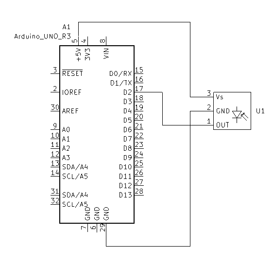
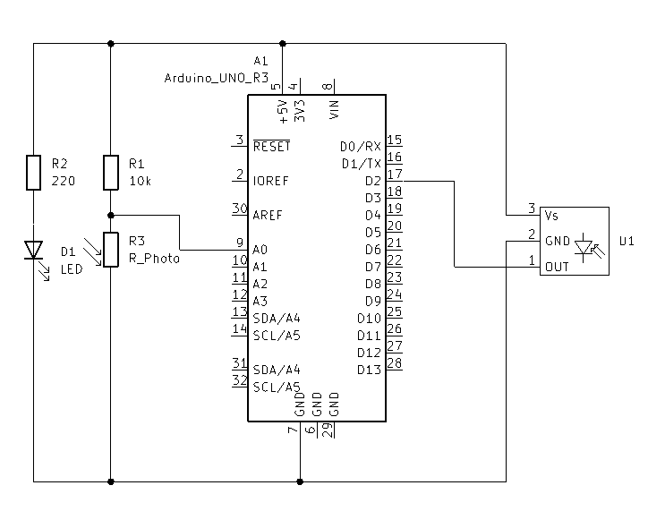
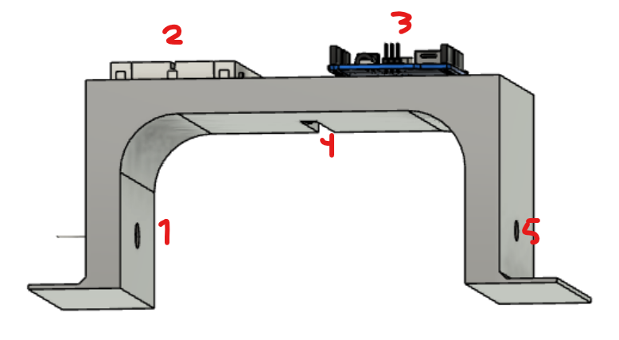
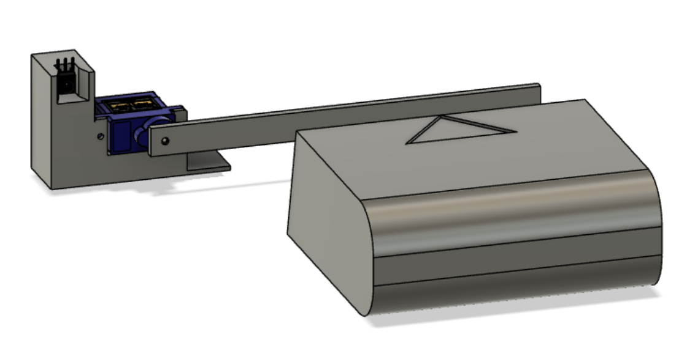

# IR kommunikkasjon Zumo32u4
Sending av IR signaler fra en zumo32u4 vha. fastmonterte leds, og mottak på en arduino uno vha [IRM-56384](https://datasheet.lcsc.com/lcsc/2201242300_Everlight-Elec-IRM-56384_C72048.pdf) IR mottaker.

## Sending 
Koden benytter seg av Zumo32u4 sine fastmonterte IR leds til å sende ut data i hennhold til NEC protokollen med en subcarier på 38kHz. Dataen som bilr sendt er en 8-bits ID og en 8-bits commando. I hennhold til NEC bil databittene send to ganger hver (en gang normalt, en gang invertert) for robusthet på signalet.

Koden er blokkerende og forhindrer annen kode i ~70ms mens pakken blir sendt.

IR ledene på Zumoen er to forroverpekende THT LEDs og to sidestilte SMD LEDs, alle med en synsvinkel på ~50&deg; hvor to og to kan benyttes samtidig. Enten høyre side og høyre front, eller venstre side og venstre front.

Koden benytter funksjoner stjålet fra Zumo proximety sensing biblioteket for og generere et PWM signal med riktig frekvens for bærebølgen. Disse funksjonene brukes så til og skur av og på PWM signalene med timing som følger NEC protokollen

## Mottak
Koden for mottak er basert på [IRremote](https://github.com/Arduino-IRremote/Arduino-IRremote) biblioteket fra shirriff. Koden er i stand til og motta IR pakker og dekode de i forhold til NEC protokollen. Mottat data blir tilgjengelig som et struct. Koden git også en feilmelding om den mottar data den ikke klarer å dekode.

Denne koden fungerer på både arduino uno og zumo32u4.

For bedre mottak på zumoen kan jumperene for og velge proximity/line sensor fjernes for og frigjøre pinnen, for og så koble en ekstern IR mottaker til den.

## Sending Arduino -> bil
For sending i motsat retning fungerer ReciveIRCommand koden på bilen med ` IR_RECEIVE_PIN 22` og SimpleSender eksempelet fra IrRemote biblioteket på arduino sender enheten(uno). Dette vil kunne brukes til og gi bilen enkle beskjeder, som feks fortelle den hva slags stasjon (mplstripe, bom ++) den kommer til

## Oppgave ideer
### Målstrek
Timing av bilens rundetid, med unike ID koder kan dette også gjøres av flere biler samtidig. Det kan da brukes komandoer for og sende komandoer til målstreken som "Start timing", "Registrer rundetid", "Avslutt timing" osv.

### komanoder til stasjoner
Kommandoen kan benyttes til å sende enkle beskjeder til stasjoner rund banen som "start lading" og "stopp lading" eller "lukk opp bomstasjon" Med et saldosystem vill man da også kunne inføre ting som bompenger.

## Kode
### SubcarierGeneration.ino
Kode for og blinke IR LEDene med en subcarier frekvens på 38kHz

### SendIRCommand.ino
Kode for og sende NEC datapakker med IR

### ReciveIRCommand.ino
Kode for og motta NEC datapakker fra IR

### LapTiming.ino
Kode for måling av rundetid på Zumo biler ved hjelp av IR datapakker for identifikasjon og break beam sensor for timing

Utkast til enkel 3D modell av tidtaknings portal. 1.5 biler bred, 1.5 biler høy og 10cm lang.

1. Photoresistor
2. Koblingsbrett
3. Arduino Uno
4. IR mottaker
5. Laser diode

### tolBooth.ino
Kode for åpning/lukking av en servobaser bomstasjon basert på kommando mottatt fra zumo biler.

### CallAndAnswer_xx.ino
Kode for og sende en forespørsel fra en arduino uno og få svar fra Zumo.

## Testing av konsept
### Sending/mottak: 

Sending og mottak av data fungerer med relativt god pålitlighet. Leslig fra omrtentlig 30&deg; til -160&deg; (0&deg; rett frem) på siden dataen sendes fra med murlighet for og vekse side. Med brightnes på 1 (~0.25% duticycle) er rekkevidden på pålitlig sending omtrentlig 50cm til siden og 2.5m forover.

~~Murlig sendestyrken burde reduseres for og minimere interferens fra andre biler skal flere kjøre samtidig.~~

### Sendings påvirkning på kjøring
Sendingen av datapakker forhindrer ikke kjøringen drastisk, men skaper en merkbar rykning i bilen om kjøreretningen må korigeres mens sendingen fåregår.

### Interference fra flere biler
Kjøres flere biler samtidig vill det oppstå interference om sendingen fåregår samtidig. Dette vil ødelegge begge datapakker. Med en sendetid på ~70ms og en rekkevidde på ~2.5m vil dette kunne delevis ungåes ved å begrense hvor ofte datapakkene sendes og skru på bilene etter hverandre

## TBD
- [x] Teste interference fra flere biler
- [x] Teste påvirkning av dutycycle for rekkevide og interference.
- [x] Teste påvirkning på kjøring
- [x] 3D modell timing portal
  - [ ] 3D print
  - [ ] Fysisk test
- [x] 3D modell bomstasjon
  - [ ] 3D print
  - [ ] Fysisk test

