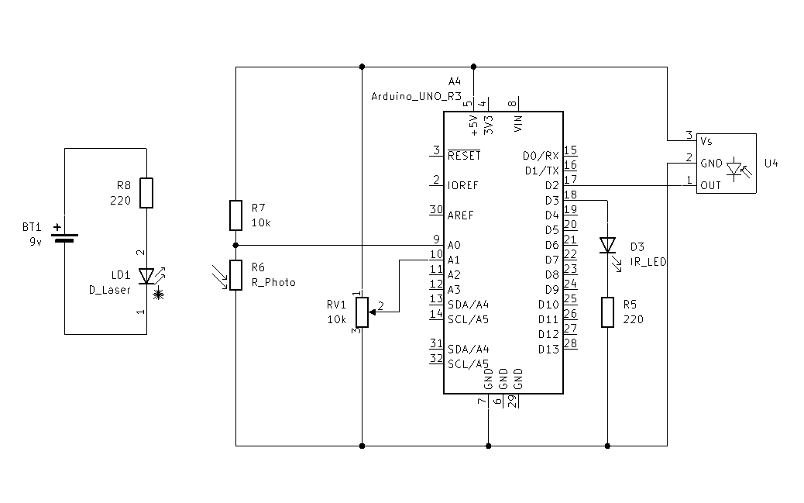
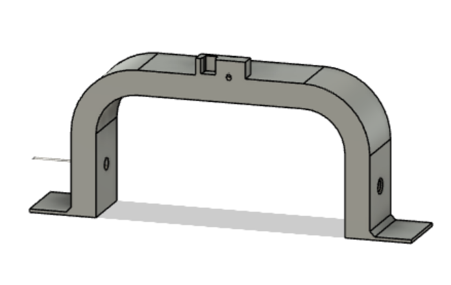

# Rundetid

- [Rundetid](#rundetid)
  - [Arduino](#arduino)
    - [Krets skjematikk](#krets-skjematikk)
    - [3D modell](#3d-modell)
    - [Kode eksempel](#kode-eksempel)
  - [Zumo](#zumo)
    - [Kode eksempel](#kode-eksempel-1)

Eksempel på tidtaking av rundetid for zumo bilene. Koden en en modifisert versjon av "CallAndAnswer" koden, hvor tidtakings portalen ber bilen om og identifisere segselv, for og så bruke den raporterte IDen til og holde styr på bilens induviduelle rundetid.

Eksempelkoden har deffinert noen ID-er og kommandoer for NEC komunikkasjonen.
|Enhet| ID|
|-----|---|
|Lyskryss| 0x01|
|Runde tidtaker | 0xC8  


|Kommando | Kode |
|----|---|
|Rødt lys | 0x34 |
|Gult lys | 0x35 |
|Grønnt lys | 0x36 |
|Identifiser bil | 0xF0|
|Svar på identifikasjon| 0x02 |
|Dette er en bomstasjon| 0xF1 |
|Lokk opp bom | 0x01 |

## Arduino
Arduino-en brukes til go identifisere zumo bilene som kjører forbi, og ta tiden på hvor lang tid de bruker på hver runde. For og gjøre dette er kretsen laget med en IR sender og mottaker, og en break-beam sensor laget med en laserdiode og en fotoresistor. Kretsen har også et potentiometer for og justere triggernivået på break-beam sensoren.

### Krets skjematikk

### 3D modell
[.STL fil](3D_modell.stl)


### Kode eksempel
[LapTimer_Arduino.ino](LapTimer_Arduino.ino)

```cpp
/*
* Program to messure lap time for cars passing a break beam
* The program uses a IR reciver to recive a ID from the car
* in order to track the lap time for multiple cars
*/
#define DECODE_NEC  // We want to decode NEC protocol

#define IR_RECEIVE_PIN 2  // Pin for IR receiver
#define IR_SEND_PIN 3   // Pin for IR sender

#include <IRremote.hpp>

#define DEVICE_ID 200  // ID of the device, used to identify the sender

#define COMMAND_IDENTIFY 0xF0     // Command for telling the robot to identify itself
#define COMMAND_TOL_STATION 0xF1  // Command for telling the robot it's at a tol station

#define COMMAND_OPEN 0x01  // Command for telling the tol station to open the gate
#define COMMAND_IDENTIFYING 0x02 // Command for answering the identify command

#define BREAK_BEAM_SENSOR A0  // Pin for break beam sensor
#define REFERENCE_PIN A1      // Pin for the refrence potmeter

#define ANSER_TIMEOUT 500  // Time between transmissions

#define BREAKBEEK_TIMEOUT 1000 // Time between each break beam detection, the car neads time to pass the beam

enum state { ON, OFF }; // Enum for timer state
state timerState = ON;  // Set initial state to OFF

int IDList[10] = { 1, 2, 3, 4, 5, 6, 7, 8, 9, 53 };  // List of car IDs
unsigned long timeList[10] = { 0 };                  // List of times for each car

unsigned long lastBreak = 0;
bool oldState = false;

int lastCarID; // ID of the last car to pass the beam

bool awaitingAnswer = false;
unsigned long lastTransmission = 0;

void setup() {
  Serial.begin(9600);
  delay(3000);

  // Just to know which program is running on my Arduino
  Serial.println(F("START " __FILE__ " from " __DATE__ "\r\nUsing library version " VERSION_IRREMOTE));

  // Print startup message
  Serial.print(F("Send IR signals at pin "));
  Serial.println(IR_SEND_PIN);
  Serial.print(F("Ready to receive IR signals of protocols: "));
  printActiveIRProtocols(&Serial);
  Serial.print(F("at pin "));
  Serial.println(IR_RECEIVE_PIN);

  // Start  IR receiver and sender
  IrReceiver.begin(IR_RECEIVE_PIN);
  IrSender.begin(DISABLE_LED_FEEDBACK);
}

void loop() {
  unsigned long timeNow = millis();
  if (timeNow - lastTransmission > ANSER_TIMEOUT) { // If it's time to send a new command
    IrSender.sendNEC(DEVICE_ID, COMMAND_IDENTIFY, 0);
    lastTransmission = timeNow;
    awaitingAnswer = true;
  }
  if (IrReceiver.decode()) {  // If we have a new IR message
    //IrReceiver.printIRResultShort(&Serial); // Print a short summary of received data

    if (IrReceiver.decodedIRData.protocol == UNKNOWN) {
      Serial.println(F("Received noise or an unknown (or not yet enabled) protocol"));
      // We have an unknown protocol here, print more info
      IrReceiver.printIRResultRawFormatted(&Serial, true);
    }
    Serial.println();
    IrReceiver.resume();  // Enable receiving of the next value

    if (awaitingAnswer && IrReceiver.decodedIRData.address != DEVICE_ID) { // If we are waiting for an answer and the answer is not from ourself
      // Print the answer
      Serial.println("Got answer");
      Serial.print("The car ID is:");
      Serial.println(IrReceiver.decodedIRData.address);

      Serial.print("Recived command is:");
      Serial.println(IrReceiver.decodedIRData.command);
      awaitingAnswer = false;
      // If the answer is an identifying command, update the last car ID
      if(IrReceiver.decodedIRData.command == COMMAND_IDENTIFYING){
        lastCarID = IrReceiver.decodedIRData.address;
      }
    }
  }
  updateBreakBeam();    // check if the break beam is broken
}

void updateBreakBeam() {
  unsigned long timeNow = millis();
  if (analogRead(BREAK_BEAM_SENSOR) < analogRead(REFERENCE_PIN)) {
    oldState = false;
    return;  // Noting detected, return
  } else if (timerState == OFF) {
    return;  // Timer is off, return
  } else if (!oldState && (timeNow - lastBreak > BREAKBEEK_TIMEOUT)) { // If the beam is broken and the debounce time has passed
    oldState = true;
    lastBreak = timeNow;
    Serial.println("Beam broken");
    printTiming();  // Print timing
  }
}

/*
* Function for printing the lap time for the last id recived
*/
void printTiming() {
  if (getIDIndex(lastCarID) != 255) {  // test for invalid id
    unsigned long timeNow = millis();  // Get current time
    Serial.print("Time for car: ");    // Print ID
    Serial.print(lastCarID);
    Serial.print(" is: ");                                                   // Print time
    Serial.println(float(timeNow - timeList[getIDIndex(lastCarID)]) / 1000.0, 1);  // pirnt time as seconds with 1 desimal.
    timeList[getIDIndex(lastCarID)] = timeNow;                               // Update time
  }
}

/*
* Function for getting the index of a ID in the IDList
* Returns index of ID if found, else returns 255
*/
uint8_t getIDIndex(uint8_t ID) {
  for (int i = 0; i < 10; i++) {
    if (ID == IDList[i]) {
      //Serial.println("ID found");
      return i;
    }
  }
  //Serial.println("ID not found");
  return 255;  // ID not found return 255
}
```
## Zumo

Koden for zumoen er en modifisert versjon av LineFolower eksempelet til zumo bilen, utvidet med IRemote kode for mottak, og funksjoner for sending av NEC datapakker.

Zumo bilen vill kontunuerlig søke etter IR kommandoer og respondere på motatte komandoer. Enten ved og justere hastigheten om det er en komando fra et lyskryss. Eller resopndere på meldingen om det er en beskjed om å identifisere seg selv eller at den ankommer en bomstasjon.

### Kode eksempel
[LapTimer_Zumo.ino](LapTimer_Zumo.ino)
```cpp
/*
* Modified version of the Zumo32U4 example "LineFollower" to work with the IR receiver
* and react to commands from the IR remote.
*/

#include <Wire.h>
#include <Zumo32U4.h>
#define DECODE_NEC
#include <IRremote.hpp>
#include <Zumo32U4IRPulses.h>

#define SUBCARIER_PERIOD 420  // The default frequency is 16000000 / (420 + 1) = 38.005 kHz
#define IR_BRIGHNESS 100        // 0-400, 0 is off, 400 is max brightness
Zumo32U4IRPulses::Direction IR_DIRECTION = Zumo32U4IRPulses::Left; // Direction of the IR LED

#define IR_RECEIVE_PIN 22   // pin for IR receiver, 22 is the front proximity sensor

#define DEVICE_ID 2  // ID of the device, used to identify the robot

// Commands for traffic light states
#define RED_LIGHT_COMMAND 52        
#define YELLOW_LIGHT_COMMAND 53
#define GREEN_LIGHT_COMMAND 54

#define COMMAND_IDENTIFY 0xF0       // Command for telling the robot to identify itself
#define COMMAND_TOL_STATION 0xF1    // Command for telling the robot it's at a tol station

#define COMMAND_OPEN 0x01   // Command for telling the tol station to open the gate
#define COMMAND_IDENTIFYING 0x02 // Command for identifying itself

unsigned long recivedCommandTime = 0;
int CommandToAnswer;
int senderID;
bool newCommand = false;

#define ANSWER_DELAY 30 // Delay before answering a command, needed for the IR receiver to be ready

const int authorisedDevices[] = { 200, 201 }; // List of authorised devices

#define YELLOW_LED 13

// This is the maximum speed the motors will be allowed to turn.
// A maxSpeed of 400 lets the motors go at top speed.  Decrease
// this value to impose a speed limit.
uint16_t maxSpeed = 400;

Zumo32U4Buzzer buzzer;
Zumo32U4LineSensors lineSensors;
Zumo32U4Motors motors;
Zumo32U4ButtonA buttonA;

Zumo32U4OLED display;

enum ledState { RED, YELLOW, GREEN }; // Traffic light states
ledState state = GREEN; 

#define YELLOW_SLOW_TIME 2000  // Time to drive slowly after yellow light
unsigned long yellowStartTime = 0;

int16_t lastError = 0;

#define NUM_SENSORS 5   
unsigned int lineSensorValues[NUM_SENSORS];

// Sets up special characters for the display so that we can show
// bar graphs.
void loadCustomCharacters() {
  static const char levels[] PROGMEM = {
    0, 0, 0, 0, 0, 0, 0, 63, 63, 63, 63, 63, 63, 63
  };
  display.loadCustomCharacter(levels + 0, 0);  // 1 bar
  display.loadCustomCharacter(levels + 1, 1);  // 2 bars
  display.loadCustomCharacter(levels + 2, 2);  // 3 bars
  display.loadCustomCharacter(levels + 3, 3);  // 4 bars
  display.loadCustomCharacter(levels + 4, 4);  // 5 bars
  display.loadCustomCharacter(levels + 5, 5);  // 6 bars
  display.loadCustomCharacter(levels + 6, 6);  // 7 bars
}

void printBar(uint8_t height) {
  if (height > 8) { height = 8; }
  const char barChars[] = { ' ', 0, 1, 2, 3, 4, 5, 6, (char)255 };
  display.print(barChars[height]);
}

void calibrateSensors() {
  display.clear();

  // Wait 1 second and then begin automatic sensor calibration
  // by rotating in place to sweep the sensors over the line
  delay(1000);

  for (int i = 0; i < 200; i++) {  // ramp up
    motors.setSpeeds(i, -i);
    delay(1);
  }
  for (uint16_t i = 0; i < 120; i++) {

    if (i == 30) {  // Speed ramp
      for (int x = -200; x < 200; x++) {
        motors.setSpeeds(-x, x);
        delay(1);
      }
    } else if (i == 90) {  // Speed ramp
      for (int x = -200; x < 200; x++) {
        motors.setSpeeds(-x, x);
        delay(1);
      }
    } else if (i > 30 && i < 90) {
      motors.setSpeeds(-200, 200);
    } else {
      motors.setSpeeds(200, -200);
    }

    lineSensors.calibrate();
  }
  motors.setSpeeds(0, 0);
}

// Shows a bar graph of sensor readings on the display.
// Returns after the user presses A.
void showReadings() {
  display.clear();

  while (!buttonA.getSingleDebouncedPress()) {
    lineSensors.readCalibrated(lineSensorValues);

    display.gotoXY(0, 0);
    for (uint8_t i = 0; i < NUM_SENSORS; i++) {
      uint8_t barHeight = map(lineSensorValues[i], 0, 1000, 0, 8);
      printBar(barHeight);
    }
  }
}

// function to read the IR receiver
void readIR() {
  if (!IrReceiver.decode()) {
    return;     // Nothing new to read, so we exit the function
  }
  IrReceiver.resume(); // Enable receiving of the next value
  if (IrReceiver.decodedIRData.command == 0) {
    return; // We have a bad reading, so we exit the function
  } else if (IrReceiver.decodedIRData.command == RED_LIGHT_COMMAND) {
    state = RED;
  } else if (IrReceiver.decodedIRData.command == YELLOW_LIGHT_COMMAND) {
    state = YELLOW;
    yellowStartTime = millis();
  } else if (IrReceiver.decodedIRData.command == GREEN_LIGHT_COMMAND) {
    state = GREEN;
  } else if (IrReceiver.decodedIRData.command == COMMAND_IDENTIFY) {
    // If we recive a command to identify, we set the parameters for answering
    recivedCommandTime = millis();
    CommandToAnswer = COMMAND_IDENTIFY;
    digitalWrite(YELLOW_LED, HIGH);
    senderID = IrReceiver.decodedIRData.address;
    newCommand = true;
  } else if (IrReceiver.decodedIRData.command == COMMAND_TOL_STATION){
    // If we recive a command for a tolstation, we set the parameters for answering
    recivedCommandTime = millis();
    CommandToAnswer = COMMAND_TOL_STATION;
    senderID = IrReceiver.decodedIRData.address;
    newCommand = true;
  }
}

// Function to update the speed of the robot based on the traffic light state
void updateSpeed() {
  switch (state) {
    case RED:
      maxSpeed = 0;
      break;
    case YELLOW:
      maxSpeed = 100;
      if (millis() - yellowStartTime >= YELLOW_SLOW_TIME) {
        state = GREEN;
      }
      break;
    case GREEN:
      maxSpeed = 400;
      break;
  }
}

// functon for handling received commands
void handleCommand(uint16_t senderID, uint16_t command) {
  if (isAuthorised(senderID)) {
    if (command == COMMAND_IDENTIFY) {
      Serial.println("Identify");
      sendCommand(DEVICE_ID, COMMAND_IDENTIFYING, IR_DIRECTION);   // Send device ID and identifying command
    } else if (command == COMMAND_TOL_STATION) {
      Serial.println("Tol station");
      sendCommand(DEVICE_ID, COMMAND_OPEN, IR_DIRECTION); //Send open command
    }
  }
}

// Function for checking if the sender is an authorised device
bool isAuthorised(uint16_t senderID) {
  for (int i = 0; i < (sizeof(authorisedDevices) / sizeof(authorisedDevices[0])); i++) {
    if (senderID == authorisedDevices[i]) {
      Serial.println("Is authorised");
      return true;
      ;
    }
  }
  Serial.println("Not authorised");
  return false;
}

// Function for sending 8 bit command in acordance with the NEC protocol
void sendCommand(uint8_t deviceID, uint8_t command, Zumo32U4IRPulses::Direction direction) {
  Serial.print("Sending : ");
  Serial.print(command);
  Serial.print(" From : ");
  Serial.println(deviceID);
  // Send a start pulse. high for 9ms, low for 4.5ms
  //Serial.println("StartPulse");
  startPulse(direction);
  delayMicroseconds(9000);
  Zumo32U4IRPulses::stop();
  delayMicroseconds(4500);

  // Send device ID.
  sendByte(deviceID, direction);

  // Send inverted device ID.
  sendByte(~deviceID, direction);

  // Send command.
  sendByte(command, direction);

  // Send inverted command.
  sendByte(~command, direction);

  // Send stop pulse. high for 562.5us, low for 562.5us
  //Serial.println("StopPulse");
  startPulse(direction);
  delayMicroseconds(560);
  Zumo32U4IRPulses::stop();
  delayMicroseconds(560);
}

// Send 8 bit byte in acordance with the NEC protocol
void sendByte(uint8_t byte, Zumo32U4IRPulses::Direction direction) {
  for (uint8_t i = 0; i < 8; i++) {   // iterate through the bits in the byte, LSB first
    uint8_t bit = (byte >> (i)) & 1;  // get the current bit
    if (bit == 1) {                   // if the bit is 1, send 1
      //Serial.print("1");
      startPulse(direction);
      delayMicroseconds(560);
      Zumo32U4IRPulses::stop();
      delayMicroseconds(1690);
    } else {  // if the bit is 0, send 0
      //Serial.print("0");
      startPulse(direction);
      delayMicroseconds(560);
      Zumo32U4IRPulses::stop();
      delayMicroseconds(560);
    }
  }
  //Serial.println("");
}

// Start the IR pulse with settings for subcarrier
void startPulse(Zumo32U4IRPulses::Direction direction) {
  Zumo32U4IRPulses::start(direction, IR_BRIGHNESS, SUBCARIER_PERIOD);  // Turn on IR LED int the specified direction with subcarrier
}


void setup() {
  // Uncomment if necessary to correct motor directions:
  //motors.flipLeftMotor(true);
  //motors.flipRightMotor(true);
  Serial.begin(9600);

  IrReceiver.begin(IR_RECEIVE_PIN);
  pinMode(YELLOW_LED, OUTPUT);

  lineSensors.initFiveSensors();
  //lineSensors.initThreeSensors();

  loadCustomCharacters();

  // Play a little welcome song
  buzzer.play(">g32>>c32");

  // Wait for button A to be pressed and released.
  display.clear();
  display.print(F("Press A"));
  display.gotoXY(0, 1);
  display.print(F("to calib"));
  buttonA.waitForButton();

  calibrateSensors();

  showReadings();

  // Play music and wait for it to finish before we start driving.
  display.clear();
  display.print(F("Go!"));
  buzzer.play("L16 cdegreg4");
  while (buzzer.isPlaying())
    ;
}

void loop() {

  readIR();
  updateSpeed();
  if (millis() - recivedCommandTime > ANSWER_DELAY && newCommand == true) {
    handleCommand(senderID, CommandToAnswer);
    newCommand = false;
    IrReceiver.start();  // Enable receiving of the next value
  }
  // Get the position of the line.  Note that we *must* provide
  // the "lineSensorValues" argument to readLine() here, even
  // though we are not interested in the individual sensor
  // readings.
  int16_t position = lineSensors.readLine(lineSensorValues);
  Serial.print("Pos:");
  Serial.print(position);

  // Our "error" is how far we are away from the center of the
  // line, which corresponds to position 2000.
  int16_t error = position - 2000;
  Serial.print("\t err:");
  Serial.print(error);

  // Get motor speed difference using proportional and derivative
  // PID terms (the integral term is generally not very useful
  // for line following).  Here we are using a proportional
  // constant of 1/4 and a derivative constant of 6, which should
  // work decently for many Zumo motor choices.  You probably
  // want to use trial and error to tune these constants for your
  // particular Zumo and line course.
  int16_t speedDifference = error / 4 + 6 * (error - lastError);
  Serial.print("\t dif:");
  Serial.println(speedDifference);

  lastError = error;

  // Get individual motor speeds.  The sign of speedDifference
  // determines if the robot turns left or right.
  int16_t leftSpeed = (int16_t)maxSpeed + speedDifference;
  int16_t rightSpeed = (int16_t)maxSpeed - speedDifference;

  // Constrain our motor speeds to be between 0 and maxSpeed.
  // One motor will always be turning at maxSpeed, and the other
  // will be at maxSpeed-|speedDifference| if that is positive,
  // else it will be stationary.  For some applications, you
  // might want to allow the motor speed to go negative so that
  // it can spin in reverse.
  leftSpeed = constrain(leftSpeed, 0, (int16_t)maxSpeed);
  rightSpeed = constrain(rightSpeed, 0, (int16_t)maxSpeed);

  motors.setSpeeds(leftSpeed, rightSpeed);
}

```