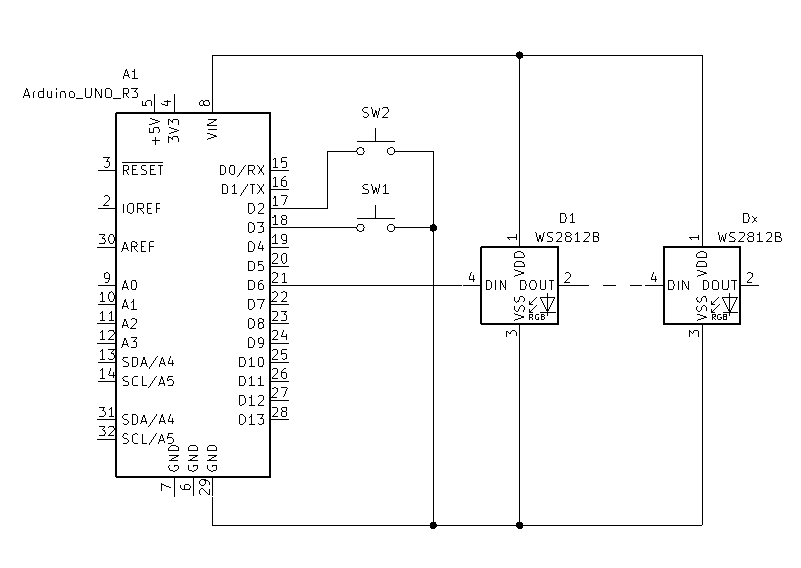

# 1D pong

En dimensjonalt pong spill på en neopixel LED stripe.

Hver spiller har en knapp for og slå ballen. Trykker spilleren på knappen mens ballen er innenfor sit felt (lysende blått eller grøndt) vill ballen sendes tilbake mot motspilleren. Avhengig av hvor langt inn på spillerens felt ballen er når knappen trykkes vill hastigheten på ballen variere, jo lengere inn, jo raskere slag.

Runden vinnes når motspilleren bommer på ballen. Når en spiller får en påengsum på `SCORE_TO_WIN` (her satt til 5) vill spillerens felt krympe med en pixel og påengsummen settes tilbake til 0. Spillet er over når første spiller krymper feltet sit til det ikke er noe felt igjenn.



[1D Pong.ino](1D%20Pong.ino)
```cpp
/*
* 1D Pong
*
* A simple game of pong on a 1D NeoPixel strip.
*
* GPOI 2 -> button w internal pullup, left player button
* GPOI 3 -> button w internal pullup, right player button
* GPOI 6 -> NeoPixel strip
*
* NUMPIXELS -> number of pixels in the strip
* PADDLE_SIZE -> number of pixels in the paddle
* MAX_SPEED -> maximum speed of the ball, px/s
* SCORE_TO_WIN -> score needed to win round
* TRIGGER_TIMEOUT -> time between triggers, ms
*
* The level goes on until one of the players reaches SCORE_TO_WIN points.
* at that point the winner's paddle will decrease in size by 1 pixel.
* The game is over when one of the paddles reaches 0 pixels.
*/

#include <Adafruit_NeoPixel.h>

#define LEFT_BUTTON 2 // Pin for the left button
#define RIGHT_BUTTON 3 // Pin for the right button

#define LED_PIN 6 // Pin for the NeoPixel strip
#define NUMPIXELS 30 // Number of pixels in the strip

Adafruit_NeoPixel strip = Adafruit_NeoPixel(NUMPIXELS, LED_PIN, NEO_GRB + NEO_KHZ800);

#define PADDLE_SIZE 3 // Number of pixels in the paddle

int paddleSizeLeft = PADDLE_SIZE; // Size of the left paddle, px
int paddleSizeRight = PADDLE_SIZE; // Size of the right paddle, px

#define MAX_SPEED 30 // Maximum speed of the ball, px/s
float speed = MAX_SPEED/2; // Speed of the ball, px/s
int ballPos = 15; // Position of the ball, px
bool ballDir = true; // Direction of the ball, true = right, false = left

#define SCORE_TO_WIN 5 // Score needed to win round
int scoreLeft = 0; // Score of the left player
int scoreRight = 0; // Score of the right player

unsigned long lastTime = 0; // Time of the last frame

#define TRIGGER_TIMEOUT 500 // Time between triggers, ms

unsigned long lastTriggerTimeLeft = 0; // Time of the last trigger of the left button
unsigned long lastTriggerTimeRight = 0; // Time of the last trigger of the right button

void setup() {
    Serial.begin(9600);

    // Set up buttons with interrupts
    pinMode(LEFT_BUTTON, INPUT_PULLUP);
    pinMode(RIGHT_BUTTON, INPUT_PULLUP);
    attachInterrupt(digitalPinToInterrupt(LEFT_BUTTON), leftPaddle, FALLING);
    attachInterrupt(digitalPinToInterrupt(RIGHT_BUTTON), rightPaddle, FALLING);

    // Set up NeoPixel strip
    strip.begin();
    strip.show();

    // Start game
    restartRound();
}

void loop() {
    unsigned long timeNow = millis();
    if(timeNow - lastTime > 1000/speed) {   // Update the game based on the speed of the ball
        lastTime = timeNow;
        strip.clear();
        drawPaddles();
        updateBall();
        strip.show();
    }
}

// Draw the paddles
void drawPaddles(){
    // Draw left paddle
    for(int i = 0; i < paddleSizeLeft; i++) {
        strip.setPixelColor(i, strip.Color(0, 0, 255-100*i));
    }
    // Draw right paddle
    for(int i = 0; i < paddleSizeRight; i++) {
        strip.setPixelColor(NUMPIXELS - i -1, strip.Color(0, 255-100*i, 0));
    }
}


void updateBall(){
    // Draw ball
    strip.setPixelColor(ballPos, strip.Color(255, 0, 0));
    // Move ball
    if(ballDir) {
        ballPos++;
    } else {
        ballPos--;
    }
    // Check if the ball is out of bounds
    if(ballPos < 0) {
        scoreRight++;
        Serial.println("\r\nRight player scored!");
        printScore();
        restartRound();
    }else if(ballPos > NUMPIXELS-1) {
        scoreLeft++;
        Serial.println("\r\nLeft player scored!");
        printScore();
        displayScore(2000); // Display the score for 2 seconds
        restartRound(); // Start a new round
    }
}

// Print the score to the serial monitor
void printScore(){
    Serial.print("Score: ");
    Serial.print(scoreLeft);
    Serial.print(" - ");
    Serial.println(scoreRight);
}

void leftPaddle(){
    if(millis() - lastTriggerTimeLeft > TRIGGER_TIMEOUT) {  // Check if the button was pressed too recently
        if (ballPos < paddleSizeLeft)  // Check if the ball is in the paddle's range
        {
            ballDir = !ballDir;
            speed = MAX_SPEED/(ballPos+1); // Set the speed of the ball based on the position of the paddle
            Serial.println("Hit!");
            Serial.print("New speed: ");
            Serial.println(speed);
        }
    }
    
    lastTriggerTimeLeft = millis();
}

void rightPaddle(){
    if (millis() - lastTriggerTimeRight > TRIGGER_TIMEOUT)  // Check if the button was pressed too recently
    {
        if(ballPos > (NUMPIXELS-1)-paddleSizeRight)  // Check if the ball is in the paddle's range
        {
            ballDir = !ballDir;
            speed = MAX_SPEED/((NUMPIXELS)-ballPos); // Set the speed of the ball based on the position of the paddle
            Serial.println("Hit!");
            Serial.print("New speed: ");
            Serial.println(speed);
        }
    }
    lastTriggerTimeLeft = millis();
}

// Blink the strip a certain color a certain number of times with a certain delay
void blinkStrip(uint8_t R, uint8_t G, uint8_t B, int times, int delayTime){
    for(int i = 0; i < times; i++) {
        strip.fill(strip.Color(R, G, B), 0, NUMPIXELS);
        strip.show();
        delay(delayTime);
        strip.clear();
        strip.show();
        delay(delayTime);
    }
}

void restartRound(){
    ballPos = NUMPIXELS/2; // Start in the middle
    ballDir = random(0, 2); // start in random direction
    speed = MAX_SPEED/2; // Start at half speed
    blinkStrip(100,100,100,1,500); // Blink white once
}

// Display the score on the strip
void displayScore(int delayTime){
    strip.clear();
    for (int i = 14; i > 14-scoreLeft; i--) {
        strip.setPixelColor(i, strip.Color(0, 0, 255));
    }
    for (int i = 15; i < 15+scoreRight; i++) {
        strip.setPixelColor(i, strip.Color(0, 255, 0));
    }
    strip.show();
    delay(delayTime);
    if(scoreLeft >= SCORE_TO_WIN || scoreRight >= SCORE_TO_WIN) { // Check if level is over
        newLevel();
    }
}

// Start a new level with a smaler paddle for the player who won
void newLevel(){
    if (scoreLeft >= SCORE_TO_WIN)
    {
        blinkStrip(0, 0, 255, 3, 250); // Blink blue 2 times
        paddleSizeLeft--;
        if(paddleSizeLeft < 1) {
            blinkStrip(0, 0, 255, 1, 2000);
            newGame();
        }
    }
    else if (scoreRight >= SCORE_TO_WIN)
    {
        blinkStrip(0, 255, 0, 3, 250); // Blink green 2 times
        paddleSizeRight--;
        if(paddleSizeRight < 1) {
            blinkStrip(0, 255, 0, 1, 2000);
            newGame();
        }
    }
    scoreLeft = 0;
    scoreRight = 0;
}

// Start a new game with the default paddle size
void newGame(){
    scoreLeft = 0;
    scoreRight = 0;
    paddleSizeLeft = PADDLE_SIZE;
    paddleSizeRight = PADDLE_SIZE;
    blinkStrip(100, 100, 100, 2, 1000); // Blink red 5 times
}
```