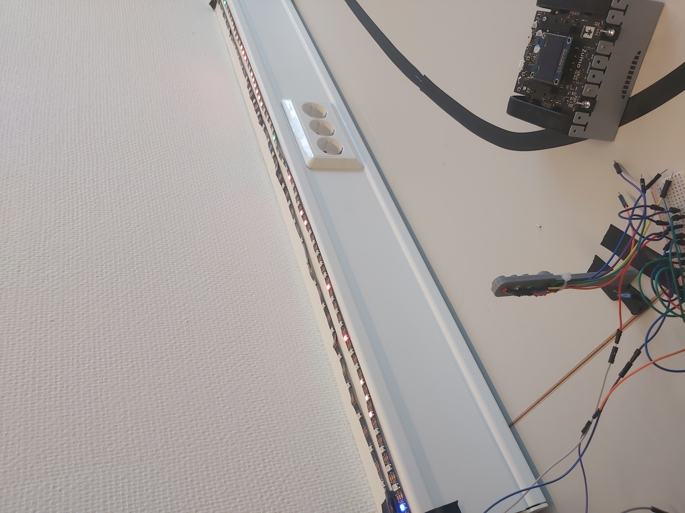
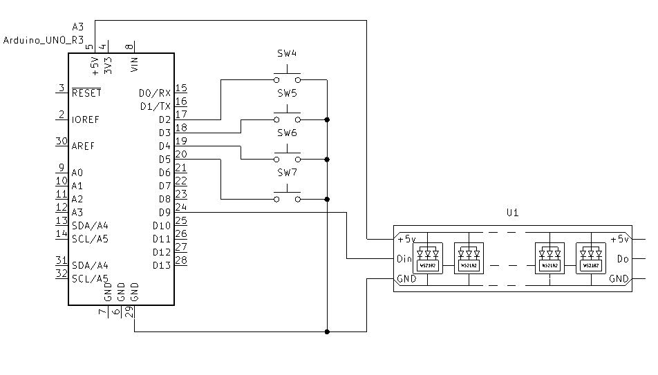

# NeopixelGame
- [NeopixelGame](#neopixelgame)
  - [Video](#video)
  - [krets skjematikk](#krets-skjematikk)
  - [Spill objekter](#spill-objekter)
    - [Spiller (player)](#spiller-player)
    - [Fiende (enemy)](#fiende-enemy)
    - [Skytter (Archer)](#skytter-archer)
    - [Pil (arrow)](#pil-arrow)
    - [Lava (lava)](#lava-lava)
    - [Død animasjon (death animation)](#død-animasjon-death-animation)
  - [Kode](#kode)
    - [Spill logikk](#spill-logikk)
    - [Spill oppsett](#spill-oppsett)
    - [Spill konfigurasjon](#spill-konfigurasjon)
    - [Kodefiler](#kodefiler)
  - [To do](#to-do)

## Video

[](Images/game_60px_1m.mp4)

## krets skjematikk
Opprettet til spillet er en enkel krets med fire kanpper for kontroll og en WS2182B LED stripe


## Spill objekter
Koden for spillet er baset på objekter for de forskjellige elementene.
### Spiller (player)
Spiller karakteren. Styres av kanppetrykk.

### Fiende (enemy)
Fiende karakterene. Plaseres utover med `.start(int pos)` funksjonen. Står stille og angriper / forsvarer basert på instillingene i config filen. Skader spillerer om spilleren treffes av angrepet, eller går inn i den. Drepes ved og treffe den med et angrep, kan ikke treffes mens den forsvarer seg.
### Skytter (Archer)
Alternativ fiende karakterer. Plaseres utover med `.start(int pos)` funksjonen. Står stille og skyter piler mot spilleren basert på instillingene i config filen. Skader spilleren om spilleren går inn i den. Drepes ved å treffe skytteren med et angrep, kan ikke forsvare seg.
### Pil (arrow)
Pilene fra skytter karakterene. Skader spilleren om de treffer mens spilleren ikke forsvarer seg.
### Lava (lava)
Hindring for spilleren. Plaseres utover med `.start(int pos)` funksjonen. Pulserer av og på med tilfeldig til basert på instillingene i config filen eller verdiene gitt ved start. Skader spilleren om spilleren går inn i den mens den er på. kan ikke drepes.
### Død animasjon (death animation)
Animasjon for død karakter. Startes  med `.start(int pos, uint32?t color)` funksjonen.

## Kode
### Spill logikk
Logikken til spillet er gjort i [NeopixelGame.ino](NeopixelGame.ino)
### Spill oppsett
Spill oppsettet gjøres i [NeopixelGame.ino](NeopixelGame.ino) ved å sette mengden objekter `#define ENEMY_AMOUNT 5`, og plasere de utover i `void startup()` med `Enemys[0].start(10);`
### Spill konfigurasjon
Konfigurasjon av spill instillingene gjøres i [config.h](config.h). Her settes pinouten til kretsen, fargene på de forskjellige objektene, og timingen til forskjellige handlinger.
```cpp
[...]
#define PLAYER_ATTACK_RANGE DEFAULT_ATACK_RANGE
#define COLOR_PLAYER 0x0000FF
[...]
```
### Kodefiler
- [NeopixelGame.ino](NeopixelGame.ino)
  Hovedfilen til spillet
- [config.h](config.h)
  konfigurasjon av spillet
- [debug.h](debug.h)
  Debug klasse
- [button.h](button.h)
  Knapp klasse. Brukes til debouncing av knappetrykk
- [player.h](player.h)
- Spiller klasse
- [enemy.h](enemy.h)
  Fiende klasse
- [archer.h](archer.h)
  Skytter klasse
- [arrow.h](arrow.h)
  Pil klasse
- [lava.h](lava.h)
  Lava klasse
- [deatAnimation.h](deathAnimation.h)
  Død animasjon klasse

## To do
- [x] Player
  - [x] Player defend
  - [x] Player attack
- [x] Lava
- [x] Enemy
  - [x] Enemy defend
  - [x] Enemy attack
- [x] Artcher
  - [x] Attack
  - [x] Defend?
- [ ] Boss
  - [ ] AoE attack
  - [ ] defend
  - [ ] push?
- [ ] Levels
- [ ] Winn