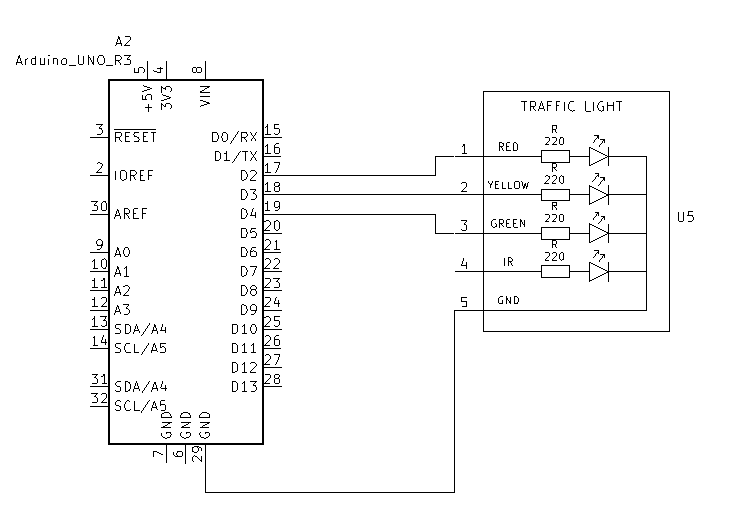
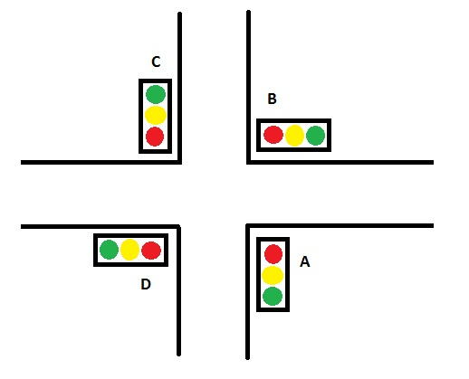
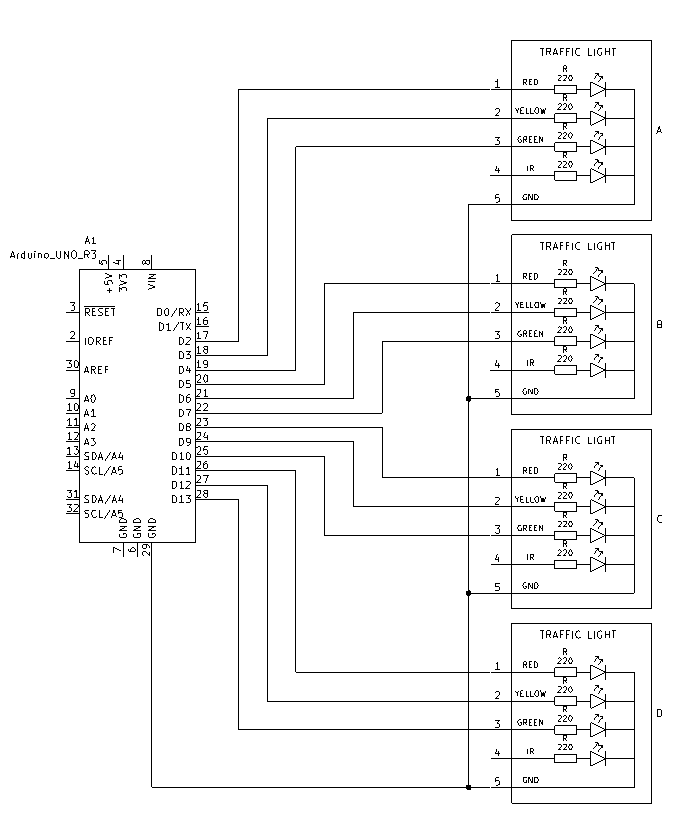

# Lyskryss
- [Lyskryss](#lyskryss)
  - [Teori](#teori)
  - [Oppgaver](#oppgaver)
    - [1](#1)
    - [2](#2)

## Teori
## Oppgaver
### 1
Styr et trafikklys med rødt, gult og grønt lys.
Sekvensen på lysene skal sammsvare med reele trafikklys: 

rødt -> rødt + gult -> grønt -> gult -> rødt ...

Traffiklyset skal være rødt i 5 sekunder, gult / gult og rødt i 2 sekunder og grønt i 5 sekunder

Koble opp kretsen som skjematikken og skriv koden.

### 2
Det ska nå kontroleres et helt lyskryss.

Koble opp tre trafikklys til og plasser de utover som i figuren.

Skriv kode for lyskrysset hvor:
- Trafikklys A og C er synkronisert
- Trafikklys B og D er synkronisert
- A og C er rødt mens B og D er grønt og motsatt
- Sekvensen og timingen på lysene er den samme som i oppgave 1