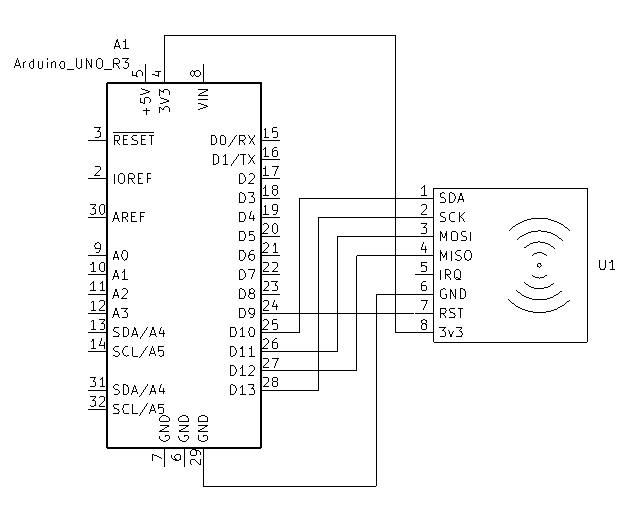

# RFID leser

## Funn
RFID leser modulen er enkell nokk og sette opp med eksisterende bibliotek og vill være fulstendig murlig og bruke i prosjektet.

Lesigen av "tagen" går fort nokk til at det bør holde og kjøre forbi leseren, trenger trolig ikke stoppe. (ikke testet)

Rekevidden på avlesningen er begrenset til ~2cm hvilket gjør det utfordrene og lese av bilen fra siden. Med en 3D printet "hump" men en helning på >10&deg; er bilen i stand til og kjøre over rfid leseren og tagen kan leses fra undersiden.

Det er murlig og skrive data til "tagen" gitt at den er av typen MIFARE Classic, men det krever kortere avstand og tar ~3s. Dvs. at bilen må stoppe over leseren. Klistremerke tagen jeg har er ikke MIFARE Classic, 

## Oppgaveideer
* Registrering av passering for rundetid, bompenger el.

## TDB
- [x] Teste murligheten for avlesning fra undersiden
- [ ] fysisk test
- [x] Teste murligheten for skriving av enkel data til tag