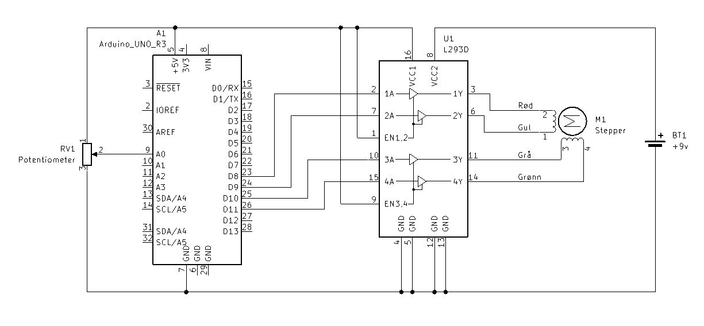

# Steppermotor 
Styring av steppermotor med en arduino uno og en L293D motordriver.
Kode hentet fra https://docs.arduino.cc/learn/electronics/stepper-motors

## oppgaveideer
* Sett opp motoren
* Speedcontroller med potmeter
* Kontroler avstand flyttet (typ heis, 3d printer el.) + gå til spesifik avstand?

## Funn
Maks hastighet ~200 rpm